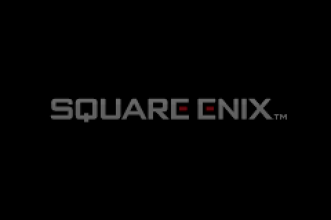

<h2>NanoBoyAdvance</h2>


[](https://www.codefactor.io/repository/github/fleroviux/NanoboyAdvance)

NanoBoyAdvance is a highly accurate Nintendo Game Boy Advance (TM) emulator.<br>
It is also intended to be reasonably efficient, bloat-free and clean code in modern C++.

You can download nightly builds [here](https://github.com/fleroviux/NanoboyAdvance/actions), however a Github account is required.<br>
For stable releases please refer to the [releases](https://github.com/fleroviux/NanoboyAdvance/releases) page.



## Running

A legitimate Game Boy Advance BIOS dump or a [replacement BIOS](https://github.com/Nebuleon/ReGBA/blob/master/bios/gba_bios.bin) is required.  
Do note though that the replacement BIOS is less accurate.

Place your BIOS file named as `bios.bin` into the same folder as the executable or provide a path via the CLI or [config.toml](https://github.com/fleroviux/NanoBoyAdvance/blob/master/src/platform/sdl/resource/config.toml)
#### CLI arguments
```
NanoboyAdvance.exe [--bios bios_path] [--force-rtc] [--save-type type] [--fullscreen] [--scale factor] [--resampler type] [--sync-to-audio yes/no] rom_path
```
See [config.toml](https://github.com/fleroviux/NanoBoyAdvance/blob/master/src/platform/sdl/resource/config.toml) for more documentation or options.

## Features

- highly accurate GBA emulation
- RTC emulation
- high quality audio
- game controller support
- basic GLSL shader support
- lightweight: minimal, configurable SDL2 frontend

## Accuracy
- very good ARM emulation
- sub-instruction hardware updates and DMA
- graphics are on-par with other emulators but are a topic of research, very little details are known 
- audio is good but needs some work here and there
- currently the only software emulator to pass the AGS aging cartridge

## Compiling

See [COMPILING.md](https://github.com/fleroviux/NanoboyAdvance/blob/master/COMPILING.md) in the root directory of this project.

## Credit

- Martin Korth: for [GBATEK](http://problemkaputt.de/gbatek.htm), a good piece of hardware documentation.
- [endrift](https://github.com/endrift): for prior [research](http://mgba.io/tag/emulation/) and [hardware tests](https://github.com/mgba-emu/suite).
- [destoer](https://github.com/destoer): for contributing research, tests and insightful discussions.
- [LadyStarbreeze](https://github.com/LadyStarbreeze): for contributing research, tests and insightful discussions.
- Talarubi, Near: for the default [GBA color correction algorithm](https://byuu.net/video/color-emulation)
