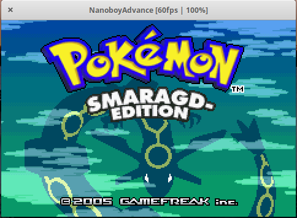

<h2>NanoboyAdvance</h2>


[](https://www.codefactor.io/repository/github/fleroviux/NanoboyAdvance)

NanoboyAdvance is a Nintendo Game Boy Advance (TM) emulator written in C++17.<br>
The goal is to create a modern, accurate Game Boy Advance emulator while also being reasonably fast
and avoiding to sacrifice too much code quality.

The emulator implements the core hardware completely and with high accuracy.
Almost all games can be emulated without any known issues, even the 'Classic NES' titles which abuse
a variety of edge-cases and undefined behaviour.

## Media



## Compiling

NanoboyAdvance can be compiled on Windows and Linux (Mac OS X and FreeBSD should work too, but are not tested).
A modern C++17-capable compiler such as Clang/Clang-CL or G++ is mandatory.

There are a few dependencies that you need to get:
- CMake
- SDL2 development library
- Qt5 (only if you build the Qt frontend)

### Clone Git repository

Make sure to clone the repository with its submodules:
```
git clone --recurse-submodules https://github.com/fleroviux/NanoboyAdvance.git
```

### Setup CMake build environment

Setup the CMake build in a folder of your choice.

#### Linux
```
cd /somewhere/on/your/system/NanoboyAdvance
mkdir build
cd build
cmake ..
```
A final `make` then compiles the emulator.
The compiled executables then can be found in `build/source/platform/`.

#### Windows

You probably need to lookup the documentation of the environment you are going use.
Make sure to point CMake to the aforementioned libraries and your compiler of choice.
I've had success building the compiler with LLVM Clang on Windows.
With `clang-cl.exe` you can also build and debug the code from Visual Studio, if you want to.
For Clang on Windows you should get the libraries built for MSVC (since Clang on Windows aims to be ABI-compatible with MSVC)

#### Miscellaneous

If you get an error regarding to `libc++fs` not being found, try commenting out `target_link_libraries(nba stdc++fs)` in `source/CMakeLists.txt`.

## Running

In order to run NanoboyAdvance you will need a BIOS file.
You can either dump your own or get an open source replacement online (https://github.com/Nebuleon/ReGBA/blob/master/bios/gba_bios.bin).
The BIOS file must be placed as `bios.bin` in the same folder as the executable.

## Known issues
- Hello Kitty Collection: Miracle Fashion Maker does not go in-game.
- James Pond - Codename Robocod does not go in-game
- Mario & Luigi Superstar Saga: bad audio on the noise channel, inaccuracy in the envelope generator?

## Acknowledgement

- GBATEK by Martin Korth: a great piece of documentation that made this emulator possible.
- Talarubi & Near (byuu): I am using their GBA color correction shader (https://byuu.net/video/color-emulation)
- mGBA by endrift: great test suite, also referenced its code for a few details.
- VisualBoyAdvance by Forgotten: inspired me to pursue emulator programming.
